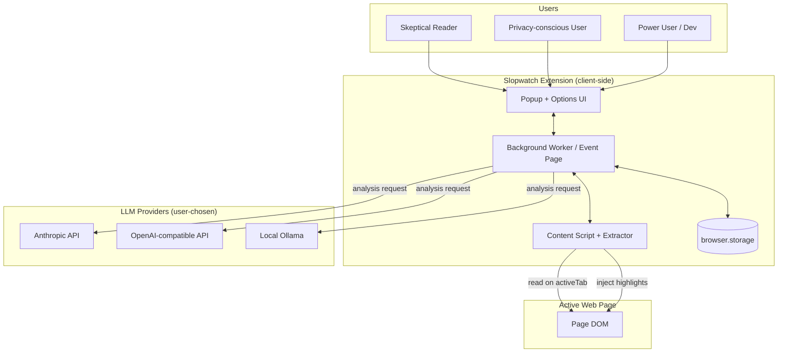
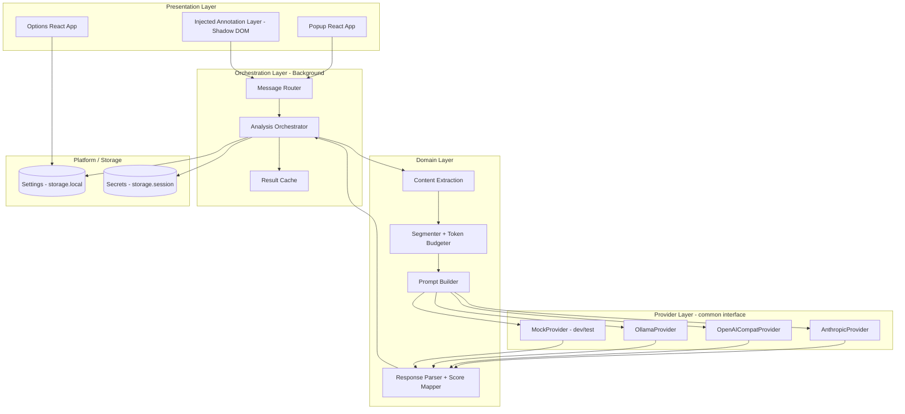
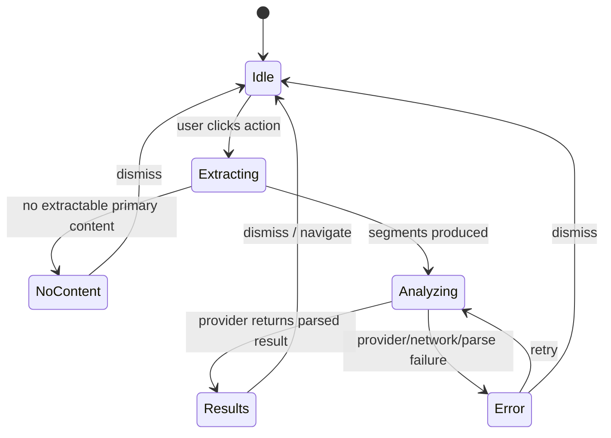
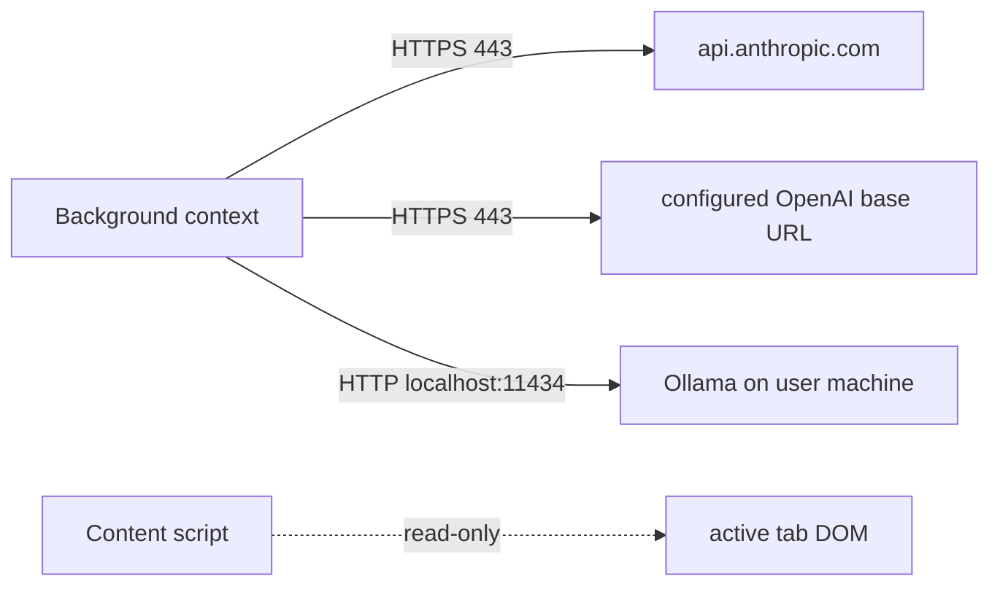

# Technical Design Document — Slopwatch

> **Slopwatch** — an on-demand, pluggable browser extension that identifies the primary
> content of a page and estimates the likelihood that it was AI-generated.
> Working codename; see README for alternatives.

| | |
|---|---|
| **Status** | Draft for review |
| **Archetype** | Platform TDD (client-side, no server) |
| **Primary target** | Firefox (Manifest V3) |
| **Secondary target** | Chromium (Chrome, Edge, Brave) |
| **Author** | — |
| **Last updated** | 2026-06-19 |

---

## 1. Introduction

This document specifies the architecture for a cross-browser extension that, on explicit
user action, extracts the main content of the current page, sends it to a user-configured
LLM provider, and returns a calibrated estimate of how likely that content is to be
machine-generated — surfaced as an overall score plus paragraph-level highlights.

**Motivation.** The web is increasingly populated with AI-generated text that is presented
as human-authored: SEO filler, fabricated reviews, synthetic news, and engagement bait.
Readers currently have no convenient, in-context way to get a second opinion on provenance.
Existing standalone "AI detectors" require copy-pasting into a separate site, are opaque about
methodology, and offer no privacy story. Slopwatch brings the check to where reading happens,
keeps the user in control of which model performs the analysis (including fully local models),
and is honest about uncertainty.

**Scope — included:**
- Manual, click-to-run analysis of the active tab (no background scanning).
- Robust extraction of primary content across articles, blogs, and common social feeds.
- A pluggable provider layer supporting **Anthropic**, **OpenAI-compatible** endpoints, and
  **local Ollama**.
- Overall AI-likelihood score, calibrated label, model reasoning, and paragraph-level
  highlighting with per-segment rationale.
- Settings UI for provider configuration, thresholds, and appearance.
- Local result caching keyed by URL + content hash.

**Scope — explicitly excluded (v1):**
- Automatic/background analysis of every page (opt-in autorun is a roadmap item only).
- Image, audio, or video provenance detection (text only).
- A hosted backend or proxy (all calls go directly from the client to the user's chosen
  provider). A managed proxy is discussed in Open Questions as a future option.
- Any first-party telemetry or analytics that leaves the device.
- Claims of forensic certainty. Slopwatch produces a *probabilistic signal*, never a verdict.

**Related documentation.**
- [`ROADMAP.md`](./ROADMAP.md) — phased feature delivery
- [`TESTING.md`](./TESTING.md) — test strategy and fixtures
- [`DEPLOYMENT.md`](./DEPLOYMENT.md) — build, sign, and store-submission pipeline
- [`USABILITY.md`](./USABILITY.md) — interaction design, accessibility, responsible-use UX
- [`../BUILD_PROMPT.md`](../BUILD_PROMPT.md) — autonomous build instructions for Claude Code

---

## 2. Context

### Current State

There is no incumbent system to migrate; this is a greenfield client-side application. The
relevant "current state" is the surrounding technology landscape the extension must integrate
with:

- **Browser extension platforms.** Firefox and Chromium both ship Manifest V3. They differ in
  the background execution model (Chromium: service worker; Firefox: non-persistent event
  page), the API namespace (`browser.*` promise-based vs `chrome.*`), and host-permission
  prompting. A framework is required to keep a single codebase building cleanly for both.
- **Content extraction.** Mozilla's `@mozilla/readability` (the engine behind Firefox Reader
  View) reliably extracts article-shaped content but does not handle infinite-scroll social
  feeds. No single library covers all surfaces.
- **LLM providers.** Three call shapes must be supported: Anthropic Messages API,
  OpenAI-compatible Chat Completions (which also covers Ollama's compat endpoint, OpenRouter,
  Together, etc.), and Ollama's native API. Each handles structured JSON output and CORS
  differently.

### Target State

A signed, store-distributed extension that is **inert by default** (no content scripts run,
no network calls, no permissions exercised until the user clicks the toolbar action). On
click, it acquires temporary access to the active tab via `activeTab`, extracts primary
content, dispatches it to the configured provider, and renders an overall score, a detail
panel, and inline paragraph highlights with hover-level explanations. Users can swap providers
at any time, including pointing at a local Ollama instance so that **no page content ever
leaves the machine**.

### Human Actors

- **Skeptical reader (~primary, the vast majority of users).** Wants a quick, trustworthy
  second opinion on whether an article or post is AI-written, without leaving the page or
  pasting text elsewhere. Cares about the result being explained, not just asserted.
- **Privacy-conscious / offline user.** Will only run analysis against a local model. Needs a
  clear guarantee and visible indicator that the local path sends nothing to the cloud.
- **Power user / developer.** Brings their own API key, may point the OpenAI-compatible
  provider at a gateway (OpenRouter, vLLM, LiteLLM), tunes thresholds and prompts, and
  inspects raw provider responses.

### System Interactions

- **Anthropic API** (`https://api.anthropic.com/v1/messages`): HTTPS, `x-api-key`,
  `anthropic-version`, and the `anthropic-dangerous-direct-browser-access: true` header for
  direct browser calls.
- **OpenAI-compatible API** (default `https://api.openai.com/v1/chat/completions`, user-overridable
  base URL): HTTPS bearer token; structured output via `response_format`.
- **Ollama** (default `http://localhost:11434`): native `/api/chat` with `format` JSON schema,
  or its OpenAI-compatible `/v1/chat/completions`. Requires the user to allow the extension
  origin via `OLLAMA_ORIGINS`.
- **The host web page**: read-only DOM access on the active tab, granted transiently by
  `activeTab` at click time. Highlights are injected into the page DOM inside a Shadow DOM
  root to avoid style collisions.

---

## 3. Architectural Diagrams

### Context Diagram



### Layered Architecture



### Sequence — Click to Annotated Result

```mermaid
sequenceDiagram
    participant U as User
    participant A as Toolbar Action
    participant BG as Background
    participant CS as Content Script
    participant CA as Cache
    participant PR as Provider
    U->>A: Click Slopwatch icon
    A->>BG: action.onClicked (grants activeTab)
    BG->>CS: inject + request extraction
    CS->>CS: Readability / feed extractor → segments[]
    CS-->>BG: {url, title, segments, contentHash}
    BG->>CA: lookup(url + contentHash)
    alt cache hit (fresh)
        CA-->>BG: cached AnalysisResult
    else cache miss
        BG->>BG: budget + build prompt
        BG->>PR: analyze(prompt) [HTTPS or localhost]
        PR-->>BG: structured JSON {overall, label, segments[], reasoning}
        BG->>BG: parse + repair + map score→label
        BG->>CA: store(result, ttl)
    end
    BG-->>CS: AnalysisResult
    CS->>CS: inject highlights (Shadow DOM) per segment index
    BG-->>A: badge text = score; open detail panel on request
    U->>CS: hover highlight → per-segment rationale tooltip
```

### Extension State Machine



---

## 4. Non-Functional Requirements

> Adapted for a client-side extension: there is no server SLA we own. "Availability" and
> "Durability" concern graceful behavior in the face of provider/network failure and the
> resilience of local state, not uptime of infrastructure we operate.

### Availability
- The extension's local functions (open popup, view cached results, change settings) MUST work
  fully offline and with **zero** provider dependency.
- When the configured provider is unreachable, the extension MUST degrade gracefully: surface a
  clear, actionable error (not a stack trace), preserve any prior cached result for the URL, and
  offer retry. No partial/garbage results are ever shown as if valid.
- Health check: an in-options "Test connection" action validates provider reachability, auth,
  and a minimal round-trip before the user relies on it.

### Performance
- Time-to-first-feedback (spinner + "extracting") MUST be < 150 ms after click (local work only).
- Extraction of a typical article (≤ 4,000 words) MUST complete in < 300 ms on a mid-range
  laptop.
- End-to-end p95 (click → rendered result) target: < 6 s for a cloud fast-tier model on a
  typical article; local-Ollama latency depends on user hardware and is surfaced, not bounded.
- The popup and options UI MUST hit interactive in < 100 ms (small bundles, no heavy frameworks
  in content scripts).

### Scalability
- Content length is the scaling axis. A configurable **token/character budget** (default
  ~6,000 words of extracted text) bounds request size and cost.
- Over-budget content uses a head/representative-middle/tail sampling strategy in v1, with a
  visible "analyzed a sample of N% of the page" notice. Full map-reduce chunking is a roadmap
  item (see ROADMAP M4).
- Result cache is bounded (LRU, default 200 entries / 5 MB) to respect `storage.local` quotas.

### Durability
- Provider calls use timeout (default 30 s) + bounded exponential backoff with jitter
  (e.g., 3 attempts: 0.5 s, 2 s, 8 s) for transient 429/5xx/network errors only; never retry on
  4xx auth/validation errors.
- A lightweight client-side rate guard prevents accidental request storms (debounce repeated
  clicks on the same tab; cap concurrent in-flight analyses to 1 per tab).
- Settings writes are atomic per key; a corrupt/partial settings object is detected on read and
  falls back to defaults rather than crashing the worker.

### Deployment
- Zero "downtime" is inherent (client-side); the concern is **safe rollout**: staged store
  releases (unlisted self-hosted build → small percentage AMO rollout → 100%).
- Rollback = re-publishing the previous signed artifact; target time-to-rollback < 30 min
  (bounded by store review for listed channel; immediate for self-hosted XPI).
- Reproducible builds: pinned toolchain (Node + pnpm lockfile), `wxt build` is deterministic
  enough for AMO source review. Infrastructure-as-code = the CI workflow itself.
- Environment parity: identical build for Firefox/Chromium targets from one source tree;
  `dev`, `beta`, and `release` channels differ only by manifest name/id and build flags.

### Data Integrity & Retention
- **Secrets:** API keys default to `storage.session` (in-memory, cleared on browser restart)
  unless the user opts into persistent `storage.local`. The persistence choice is explicit and
  explained. Keys are never logged, never sent anywhere except the provider they belong to, and
  never included in cached results.
- **Encryption in transit:** all cloud calls are HTTPS only; the extension refuses to send a key
  over a non-HTTPS base URL except for explicit `localhost`/`127.0.0.1` Ollama.
- **Encryption at rest:** the browser does not encrypt `storage.local`; this limitation is
  disclosed in-UI (see Security, §7).
- **Input validation:** all provider responses are parsed against a strict JSON Schema (Zod);
  malformed responses trigger a single repair attempt, then a clean error.
- **Retention:** cached results carry a TTL (default 7 days) and are user-clearable with one
  click. No data is retained off-device.

### Analytics & ETL
- **Default: no telemetry leaves the device.** This is a core trust property, not a toggle that
  defaults on.
- An optional, off-by-default, fully local diagnostics log (ring buffer, last N analyses:
  provider, latency, token counts, error class — never content, never keys) aids debugging and
  is viewable/exportable by the user only.
- "Metrics" in the traditional sense are surfaced to the user in-UI (last latency, tokens used,
  estimated cost for cloud calls) rather than shipped anywhere.

### Technical Debt
- **Debt being addressed:** none inherited (greenfield). The project establishes the canonical
  cross-browser scaffold and provider abstraction that future Displace extensions can reuse.
- **Acceptable new debt (deliberate, v1):**
  - Head/middle/tail sampling instead of full chunked analysis for over-budget pages.
  - Paragraph-index-granular highlighting rather than arbitrary character spans (chosen for
    robustness; finer granularity is a roadmap item).
  - Firefox-first automated E2E gap: Chromium E2E via Playwright is automated; Firefox E2E is a
    documented manual smoke checklist (see TESTING) until tooling matures.
  - Social-feed extractors cover a small named allowlist of platforms in v1; the long tail falls
    back to a generic visible-text heuristic.

### Testability
- Unit coverage target **≥ 85%** for the domain layer (extraction adapters, segmenter, prompt
  builder, parser, score→label mapper) and provider adapters.
- Provider adapters tested against recorded, sanitized fixture responses (VCR-style) plus a
  deterministic `MockProvider`.
- Extension API surface mocked via `wxt/testing` `fakeBrowser` for popup/options/background unit
  tests.
- E2E: Playwright (Chromium) loads the unpacked extension and exercises the full click→annotate
  flow against the `MockProvider`. Firefox: `wxt dev -b firefox` + manual smoke checklist.
- A small corpus of known-human and known-AI fixture pages provides regression coverage on the
  *prompt + parser*, not on absolute detector accuracy (which is provider-dependent and explicitly
  not asserted).

### Rollout
- Phased per ROADMAP: **M1** internal/unlisted → **M2** AMO listed beta (small rollout %) →
  **M3** AMO 100% + Chromium listing.
- Advancement criteria gate each phase (see §9 and ROADMAP): e.g., promote to AMO beta only after
  green CI, manual Firefox smoke pass on 2 OSes, and successful round-trip against all three
  provider types.
- No feature flags server (client-side); risky features ship behind in-extension
  experimental toggles (default off).
- Documentation: an in-extension first-run walkthrough plus a `README` quickstart accompany M2.

---

## 5. Logical Overview

### Build Channels / Environments

| Channel | Manifest name | Extension ID | Distribution |
|---------|---------------|--------------|--------------|
| Dev | Slopwatch (Dev) | `slopwatch-dev@displace.tech` | `about:debugging` / unpacked |
| Beta | Slopwatch (Beta) | `slopwatch-beta@displace.tech` | AMO unlisted / small-% listed |
| Release | Slopwatch | `slopwatch@displace.tech` | AMO listed; CWS |

> ⚠️ ASSUMPTION: extension IDs use a `@displace.tech` Gecko ID convention. Adjust to the final
> publisher identity.

### Core Modules

| Module | Purpose | Notes |
|--------|---------|-------|
| `entrypoints/background` | Orchestration, provider dispatch, cache, message router | Event page (FF) / service worker (Chromium) |
| `entrypoints/popup` | Trigger analysis, show overall result + detail panel | React, small bundle |
| `entrypoints/options` | Provider config, thresholds, appearance, diagnostics | React |
| `entrypoints/content` | Extraction + injected annotation layer | Vanilla TS + Shadow DOM |
| `lib/extraction` | Readability adapter + per-platform feed extractors + generic fallback | |
| `lib/providers` | `AnalysisProvider` interface + 3 concrete + `MockProvider` | |
| `lib/analysis` | Segmenter, token budgeter, prompt builder, response schema + parser, score→label | Pure functions, heavily tested |
| `lib/storage` | Typed settings + secrets wrappers over `browser.storage` | |
| `lib/messaging` | Typed message contracts between contexts | |

### Architecture Decisions

- **AD-1: Use the WXT framework.** It produces clean MV3 builds for Firefox *and* Chromium from
  one source tree, abstracts the background-model and namespace differences, integrates `web-ext`
  for Firefox dev/run, ships first-class Vitest support (`wxt/testing`), and provides
  `wxt zip`/`wxt submit` for store packaging. Rationale: eliminates the largest source of
  cross-browser accidental complexity. *Alternative considered:* Vite + `vite-plugin-web-extension`
  (more manual cross-browser wiring); plain webpack (heavier, slower DX).
- **AD-2: `activeTab` over broad host permissions for page access.** The product is defined as
  "does nothing until clicked"; `activeTab` grants transient access to the active tab exactly at
  click time, which is the strictest permission model that satisfies the requirement and the
  easiest to justify in store review. Broad `<all_urls>` host access is explicitly rejected.
- **AD-3: Optional host permissions for provider endpoints.** Permissions for
  `api.anthropic.com`, the configured OpenAI base, and the Ollama host are requested **at runtime**
  when the user first configures/uses that provider, not granted up front. Keeps the install-time
  permission prompt minimal.
- **AD-4: Three providers behind one interface; OpenAI-compatible doubles as a gateway.** A single
  `OpenAICompatProvider` (configurable base URL) serves OpenAI, OpenRouter, vLLM, LiteLLM, and
  Ollama's compat endpoint, reducing surface area. A dedicated `OllamaProvider` (native API) is
  retained for first-class local UX (model listing, structured `format`). `AnthropicProvider` is
  separate due to its distinct headers/message shape.
- **AD-5: Paragraph-index segmentation for highlight mapping.** Content is segmented into stable,
  indexed paragraphs; the model returns suspicious indices with per-index confidence and rationale;
  the content script re-applies highlights by index. This avoids brittle span-matching and survives
  minor DOM differences.
- **AD-6: Injected UI lives in Shadow DOM.** All on-page annotation (highlights, tooltips, badge,
  detail panel) is rendered inside a closed Shadow DOM root with self-contained styles to prevent
  bleed in either direction.
- **AD-7: Probabilistic framing is a hard product invariant.** The UI never renders a bare binary
  "AI / Human." Score + calibrated label (with an explicit *Uncertain* band) + reasoning are shown
  together, always.

---

## 6. Infrastructure

> For a client-side extension, "infrastructure" is the build/release toolchain and the browser
> runtime contract, not provisioned servers.

### Compute / Runtime
- **Runtime contract:** Manifest V3. Chromium → background **service worker**; Firefox →
  non-persistent **event page** (`background.scripts`). WXT generates the correct manifest per
  target from a single `defineBackground()` entrypoint.
- Background is **event-driven and ephemeral**: it must assume it can be torn down between events,
  so all durable state lives in `browser.storage`; in-flight analysis state is re-derivable.
- Content scripts are injected on demand via the `scripting` API at click time (not declared for
  all URLs).

### Secrets & Configuration
- **Storage mechanism:** `browser.storage.session` (default, in-memory) for API keys;
  `browser.storage.local` (opt-in) for persistence; `browser.storage.local` always for
  non-secret settings.
- **Rotation:** user-driven (re-enter key); the extension never holds keys beyond the chosen scope.
- **Access pattern:** only the background context reads secrets, only when constructing a provider
  request. The popup/options never receive a key back after it's saved (write-only from the UI's
  perspective; the field shows a masked "configured" state).
- **Config caching:** settings are read once per worker wake and cached in memory for the
  worker's lifetime; changes are pushed via `storage.onChanged`.

### Other Components
- **Cache:** LRU result cache in `storage.local`, keyed by `sha256(url + normalizedContent)`,
  TTL-bounded, size-capped, user-clearable.
- **No CDN, DNS, certificates, or queues** are owned by this project. TLS is the providers' and
  the browser's responsibility.
- **CI infrastructure:** GitHub Actions runners only (no self-hosted infra required for v1).

---

## 7. Network Architecture

> Reframed for an extension: the "network" is the set of egress endpoints, the CORS preconditions
> for reaching them from a browser context, and the permission model that gates them.

### Topology / Egress



All egress originates from the **background** context (extension origin
`moz-extension://…` / `chrome-extension://…`), never from injected page context, so the page's
own CSP cannot interfere and page scripts cannot observe the calls or keys.

### Permission / "Firewall" Rules (as narrow as possible)

- **Install-time permissions:** `activeTab`, `storage`, `scripting`. No host permissions.
- **Optional host permissions (requested at runtime, per provider in use):**
  - Anthropic enabled → request `https://api.anthropic.com/*`
  - OpenAI-compatible enabled → request the origin of the configured base URL only
  - Ollama enabled → request `http://localhost:11434/*` (or the user's configured host)
- **Egress allow:** only the host(s) for the currently configured provider(s). Nothing else.

### CORS & Provider Preconditions

| Provider | Endpoint | Browser-call requirement |
|----------|----------|--------------------------|
| Anthropic | `POST /v1/messages` | Send `anthropic-version`, `x-api-key`, and `anthropic-dangerous-direct-browser-access: true`. The "dangerous" header name reflects that the key is exposed client-side — surfaced as a warning. |
| OpenAI-compatible | `POST {base}/v1/chat/completions` | Bearer token. CORS is permitted by OpenAI for direct browser use; key exposure warning applies. Gateways (OpenRouter/LiteLLM) similar. |
| Ollama | `POST /api/chat` (or compat `/v1/chat/completions`) | User must set `OLLAMA_ORIGINS` to allow the extension origin (e.g., `moz-extension://*`, `chrome-extension://*`, or `*` for local-only machines). Setup instructions provided in-UI. |

### Security (data protection / secrets / authz)

- **Key exposure threat.** Cloud keys live in the client; anyone with the user's API key can incur
  cost. Mitigations: session-only storage by default, prominent warnings, a recommendation to use
  scoped/limited keys, and the local-Ollama path for users who want zero key exposure. *This is the
  central security tradeoff and is documented honestly rather than hidden.*
- **At-rest exposure.** `storage.local` is plaintext on disk in the profile; if the user opts into
  persistence, the UI states this plainly and recommends OS disk encryption. (Building a
  passphrase-derived encryption layer over keys is an Open Question — it shifts, but does not
  eliminate, the trust boundary because the extension still decrypts in memory to use the key.)
- **Content privacy.** With a cloud provider, page content is transmitted to a third party; the UI
  shows a clear, persistent indicator of *where this analysis runs* (cloud vs local) before and
  after each run. The Ollama path keeps content on-device.
- **Isolation.** Extension storage is isolated from web pages and other extensions; injected UI is
  Shadow-DOM-isolated; the content script reads but only writes annotation nodes.
- **Supply chain.** Dependencies pinned via lockfile; no remotely-hosted code (forbidden by MV3 and
  store policy); Dependabot/Renovate for updates; CI runs `pnpm audit`.

---

## 8. Software Architecture

### "Authentication" (provider auth model)

There is no user account. "Auth" means how the extension authenticates to each provider:

```ts
// Provider auth is per-provider config, resolved at request time in the background.
type ProviderId = "anthropic" | "openai_compat" | "ollama" | "mock";

interface ProviderConfig {
  id: ProviderId;
  model: string;
  baseUrl?: string;          // openai_compat / ollama
  // secrets resolved separately from session/local storage, never persisted in this object:
  // anthropic/openai → apiKey ; ollama → none
}
```

- **Anthropic:** `x-api-key` + `anthropic-version` + dangerous-direct-browser-access header.
- **OpenAI-compatible:** `Authorization: Bearer <key>`.
- **Ollama:** none (local trust); requires `OLLAMA_ORIGINS` on the daemon.
- Keys are fetched from `storage.session`/`storage.local` only inside the background request path
  and zeroized from the local variable scope after the fetch resolves.

### The Provider Interface

```ts
interface ExtractedContent {
  url: string;
  title: string;
  siteName?: string;
  segments: { index: number; text: string }[]; // stable paragraph indices
  truncated: boolean;             // true if budget forced sampling
  sampledFraction: number;        // 0..1 of original content actually sent
  contentHash: string;
}

type Label = "likely-human" | "uncertain" | "likely-ai";

interface SegmentFlag {
  index: number;                  // maps back to ExtractedContent.segments
  aiLikelihood: number;           // 0..1
  rationale: string;              // short, human-readable
}

interface AnalysisResult {
  overall: number;                // 0..1 likelihood AI-generated
  label: Label;                   // derived via thresholds (see mapper)
  reasoning: string;              // overall explanation, surfaced verbatim
  segments: SegmentFlag[];
  provider: ProviderId;
  model: string;
  ranLocally: boolean;            // for the privacy indicator
  usage?: { inputTokens?: number; outputTokens?: number; estCostUsd?: number };
  meta: { latencyMs: number; truncated: boolean; sampledFraction: number; schemaRepaired: boolean };
  createdAt: number;
}

interface AnalysisProvider {
  readonly id: ProviderId;
  /** Validate config + minimal round trip; used by "Test connection". */
  validate(): Promise<{ ok: boolean; detail?: string }>;
  /** Run analysis. MUST return schema-valid AnalysisResult or throw a typed ProviderError. */
  analyze(content: ExtractedContent, signal: AbortSignal): Promise<AnalysisResult>;
  /** Optional: list available models (Ollama, some gateways). */
  listModels?(): Promise<string[]>;
}
```

- **Structured output.** Each provider requests strict JSON: Anthropic via a single tool / JSON
  instruction; OpenAI-compatible via `response_format: { type: "json_schema" }` where supported,
  else `json_object`; Ollama via native `format: <jsonSchema>`. A shared **Zod** schema validates
  the result; one repair attempt re-prompts with the validation error before failing.
- **Score → label mapping** is a pure function of `overall` and user thresholds (defaults:
  `< 0.35` → likely-human, `0.35–0.65` → uncertain, `> 0.65` → likely-ai). The *Uncertain* band is
  non-removable (AD-7).

### Prompt Design (summary)

The prompt instructs the model to act as a careful linguistic analyst that estimates the
probability of AI authorship from stylistic signals (uniform cadence, low burstiness, hedging
filler, generic transitions, absence of specific lived detail, etc.), to return a calibrated
0–1 overall probability, a short overall rationale, and per-segment flags for the supplied indexed
paragraphs, and to **explicitly acknowledge uncertainty** and avoid over-claiming. The full prompt
template lives in `lib/analysis/prompt.ts` and is unit-tested for shape and injected
content-escaping. (Indexed paragraphs are delimited and content is escaped to resist prompt
injection from page text.)

### Core Technologies

| Component | Technology | Version (target) |
|-----------|-----------|------------------|
| Framework | WXT | latest 0.20.x+ |
| Language | TypeScript | 5.x (strict) |
| UI (popup/options) | React | 18+ via `@wxt-dev/module-react` |
| On-page UI | Vanilla TS + Shadow DOM | — |
| Extraction | `@mozilla/readability` | latest |
| Sanitization | DOMPurify | latest |
| Validation | Zod | 3.x |
| Unit/component tests | Vitest + `wxt/testing` (`fakeBrowser`) + Testing Library | latest |
| E2E | Playwright (Chromium) | latest |
| Firefox dev/run | `web-ext` (via WXT) | latest |
| Package manager | pnpm | 9.x (lockfile committed) |
| Lint/format | ESLint + Prettier | latest |

### Local Development

- `pnpm install`
- `pnpm dev` → `wxt dev` (Chromium with HMR)
- `pnpm dev:firefox` → `wxt dev -b firefox` (launches Firefox via web-ext with the extension loaded)
- `pnpm test` / `pnpm test:watch` (Vitest), `pnpm e2e` (Playwright), `pnpm lint`, `pnpm typecheck`
- A `.env`-free design: no build-time secrets; the `MockProvider` is selectable in dev for
  offline UI work.

### Deployment (build/release)

- `pnpm build` / `pnpm build:firefox` → `wxt build [-b firefox]`
- `pnpm zip:firefox` → `wxt zip -b firefox` produces the extension package **and** the
  AMO-required sources archive.
- `pnpm zip:chrome` → `wxt zip` (Chromium).
- Image tagging analog: git tag `vX.Y.Z` drives a release; manifest version is sourced from
  `package.json`.
- Rollback = re-publish previous signed artifact (see DEPLOYMENT).

### Error Handling & Standards

- A single `ProviderError` type carries `{ kind: "auth" | "rate_limit" | "network" | "timeout" |
  "bad_response" | "cors" | "unknown", message, retryable }`. The UI maps each kind to a specific,
  human-friendly remediation (e.g., `cors` for Ollama → "Set OLLAMA_ORIGINS and restart Ollama,"
  with a copy-paste snippet).
- Status conventions: provider HTTP errors are normalized into `ProviderError.kind`; the UI never
  shows raw HTTP bodies to the user (raw response is available only in the optional local
  diagnostics view).
- Correlation: each analysis gets a local `runId` used to correlate the (optional, local)
  diagnostics entry, the cache key, and any in-UI status.

---

## 9. Implementation Plan

Ordered low → high risk. Full milestone detail in [`ROADMAP.md`](./ROADMAP.md); this section is
the engineering decomposition.

### Phases

- **Phase 0 — Scaffold (low risk).** WXT + TS + React + lint/test harness; CI green on an empty
  build for both targets. *Success:* `wxt build` and `wxt build -b firefox` pass in CI; popup opens
  showing a placeholder.
- **Phase 1 — Vertical slice with MockProvider (low risk).** Click → extract (Readability only) →
  `MockProvider` → overall score + paragraph highlights. *Success:* full click-to-annotate flow
  works end-to-end against deterministic mock; Playwright E2E green.
- **Phase 2 — Real providers (medium risk).** Implement Anthropic, OpenAI-compatible, and Ollama
  adapters with structured output, validation, repair, and "Test connection." Runtime
  optional-permission requests. *Success:* successful real round-trip against all three provider
  types; CORS remediation verified for Ollama.
- **Phase 3 — Robustness & UX (medium risk).** Token budgeter + sampling, result cache, error
  taxonomy + remediations, detail panel, privacy indicator, options polish, accessibility pass.
  *Success:* NFR performance/error targets met; a11y checklist passes.
- **Phase 4 — Feeds + hardening (higher risk).** Per-platform feed extractors (named allowlist) +
  generic fallback; prompt-injection escaping hardening; diagnostics view. *Success:* feed
  extraction validated on the allowlist fixtures.
- **Phase 5 — Release engineering (medium risk).** AMO source-review packaging, store listing,
  `wxt submit` automation, Chromium listing. *Success:* signed beta on AMO; reproducible build
  documented.

### Tickets (engineering decomposition)

**Story 1: Project scaffold & CI**
- *Description:* Initialize WXT (React module, TS strict), ESLint/Prettier, Vitest + `wxt/testing`,
  Playwright; add GitHub Actions (install → lint → typecheck → unit → build both targets → zip
  artifacts).
- *Acceptance:* `pnpm lint && pnpm typecheck && pnpm test && pnpm build && pnpm build:firefox` pass
  locally and in CI; artifacts uploaded.

**Story 2: Messaging & storage contracts**
- *Description:* Typed message router between popup/content/background; typed settings + secrets
  wrappers over `browser.storage`, with `storage.session` default for keys and `storage.onChanged`
  propagation.
- *Acceptance:* round-trip messages typed end-to-end; secrets never returned to UI after save;
  corrupt-settings read falls back to defaults (unit-tested with `fakeBrowser`).

**Story 3: Extraction (Readability) & segmenter**
- *Description:* Clone document, run Readability, segment into indexed paragraphs, compute content
  hash; `isProbablyReaderable` gate with graceful NoContent state.
- *Acceptance:* fixture articles extract to expected segment counts; non-article fixture yields
  NoContent; ≥ 85% coverage on the module.

**Story 4: Analysis core (prompt, schema, mapper)**
- *Description:* Prompt builder with content escaping + indexed paragraphs; Zod result schema; one
  repair attempt; pure score→label mapper with configurable thresholds and non-removable Uncertain
  band.
- *Acceptance:* prompt snapshot tests; schema rejects malformed responses; mapper boundary tests;
  injection fixture does not alter instruction framing.

**Story 5: MockProvider + vertical slice + E2E**
- *Description:* Deterministic `MockProvider`; orchestrator wiring click→extract→analyze→annotate;
  Shadow-DOM highlight layer with per-segment tooltip; overall badge.
- *Acceptance:* Playwright (Chromium) drives the full flow against mock; highlights map to correct
  indices; manual Firefox smoke passes.

**Story 6: AnthropicProvider**
- *Description:* Messages API call with required headers, JSON output, validation/repair, error
  normalization; runtime host-permission request for `api.anthropic.com`.
- *Acceptance:* real round-trip returns schema-valid result; auth error → `kind:"auth"` with
  remediation; recorded fixture replays in unit tests.

**Story 7: OpenAICompatProvider**
- *Description:* Chat Completions with `response_format` structured output + `json_object`
  fallback; configurable base URL; bearer auth; model field.
- *Acceptance:* round-trip against OpenAI and against one gateway base URL; structured-output and
  fallback paths both covered.

**Story 8: OllamaProvider**
- *Description:* Native `/api/chat` with `format` JSON schema; `listModels` via `/api/tags`;
  localhost host-permission; CORS remediation UX (`OLLAMA_ORIGINS` snippet).
- *Acceptance:* local round-trip succeeds; missing `OLLAMA_ORIGINS` surfaces `kind:"cors"` with
  copy-paste fix; `ranLocally:true` set and reflected in privacy indicator.

**Story 9: Budgeter, cache, error UX, detail panel**
- *Description:* Token/char budget with head/middle/tail sampling + visible notice; LRU TTL cache;
  full error taxonomy → remediations; detail panel listing per-segment rationales and usage/cost.
- *Acceptance:* over-budget page shows sampled notice and stays under budget; cache hit avoids a
  network call; each error kind renders its remediation.

**Story 10: Options, privacy indicator, accessibility, diagnostics**
- *Description:* Provider config UI (masked key state, persistence opt-in with warning, test
  connection), thresholds, appearance (highlight color/style, high-contrast), persistent
  cloud-vs-local indicator, optional local diagnostics ring buffer, first-run walkthrough.
- *Acceptance:* a11y checklist (keyboard nav, ARIA, contrast, reduced-motion) passes; persistence
  opt-in shows at-rest warning; diagnostics never contain content or keys.

**Story 11: Feed extractors + injection hardening**
- *Description:* Named-allowlist feed extractors + generic visible-text fallback; escaping
  hardening with adversarial fixtures.
- *Acceptance:* allowlist feed fixtures extract primary posts; adversarial page text cannot change
  the model's instruction framing in tests.

**Story 12: Release packaging & submission**
- *Description:* AMO sources archive via `wxt zip -b firefox`; documented reproducible build;
  `wxt submit` config for AMO + CWS gated on tags; store listing copy + screenshots; data-disclosure
  text.
- *Acceptance:* signed beta available on AMO unlisted; CI tag-release dry-run succeeds; store
  metadata complete.

### Decommissioning
Not applicable (greenfield, nothing to retire).

---

## 10. Monitoring & Observability

> No server to monitor. Observability is user-facing and local-only by default.

### Metrics (surfaced in-UI, not shipped)
- Per analysis: latency, input/output tokens (when provider reports), estimated cost (cloud),
  provider/model used, whether content was sampled, whether schema repair occurred.
- Optional local diagnostics ring buffer (last N): timestamps, provider, latency, token counts,
  error class. **Never content, never keys.**

### "Alarms" (in-product signals, not paging)
- **Critical (block the run, show remediation):** auth failure, CORS misconfiguration, provider
  unreachable, repeated schema-invalid responses.
- **Warning (run completes, but flagged):** content was sampled (page exceeded budget), high
  latency (> warn threshold), schema required repair, low provider confidence in its own output.

### Dashboards (the options "Diagnostics" tab)
- Recent runs table (from the optional ring buffer).
- Current provider/model + connection test result.
- Cache stats (entries, size, hit rate) with a "clear cache" action.
- Cumulative estimated cloud spend for the session (rough, user-cleared).

---

## 11. Rollback Plan

### Triggers
- A released build crashes the background worker, fails the core click→analyze flow on a major
  browser version, leaks a key into logs/storage where it shouldn't be, or sends content to a
  provider the user did not select.
- A provider API change breaks a previously working adapter for a meaningful share of users.

### Procedure
1. **Immediate (self-hosted/unlisted channel):** re-publish the previous signed XPI; users on the
   unlisted channel update on next check. For the listed channel, submit the prior artifact as a
   new version (store review applies) and, if severe, request expedited review / disable the
   listing.
2. **Short-term:** revert the offending commit, cut a patch release (`vX.Y.(Z+1)`), ship a hotfix
   build through CI.
3. **Investigation:** reproduce with the optional diagnostics export (user-provided) and fixtures;
   add a regression test capturing the failure.
4. **Fix forward:** redeploy with a small-percentage AMO rollout before going to 100%.

---

## 12. Conclusion

Slopwatch is a privacy-respecting, on-demand browser extension that gives readers an explained,
probabilistic second opinion on whether page content is AI-generated, using a provider of their
choice — including fully local models so that nothing need leave the device. The architecture
leans on `activeTab` for a minimal-permission, click-to-run model, a single provider interface
across Anthropic / OpenAI-compatible / Ollama, robust index-based highlight mapping, and a hard
product invariant that uncertainty is always communicated rather than hidden.

**Key benefits**
- Strictest reasonable permission posture (`activeTab`, no broad host access).
- True provider portability, including a zero-egress local path.
- Honest, calibrated output with paragraph-level, explained highlights.
- One source tree, two browser targets, reproducible store builds.

**Next steps**
1. Confirm the working name and publisher/Gecko ID convention.
2. Approve AD-1 (WXT) and AD-2 (`activeTab`) as the load-bearing decisions.
3. Hand `BUILD_PROMPT.md` to Claude Code to execute Phase 0–1 (scaffold + mock vertical slice).
4. Provision provider test credentials (or a local Ollama) for Phase 2.

**Open Questions**
- ⚠️ Should v1 offer an **optional managed proxy** so users without their own keys can try the
  product without exposing a key client-side? (Adds backend + cost; conflicts with the no-server
  scope. Likely a post-v1 decision.)
- ⚠️ Should keys support **passphrase-derived encryption at rest**? It improves the at-rest story
  but the extension must still decrypt in memory to use the key, so it shifts rather than removes
  the trust boundary. Evaluate demand before building.
- ⚠️ How aggressively should we pursue **heuristic pre-filters** (perplexity/burstiness) to reduce
  cost and add an offline signal independent of the LLM? (See ROADMAP M6.)
- ⚠️ Final default models per provider need confirmation at build time (model lineups change);
  defaults should bias toward the cheapest capable tier and be trivially user-overridable.
- ⚠️ Which social platforms make the v1 feed-extractor allowlist? (Depends on where synthetic
  content is most concentrated and on DOM stability.)
